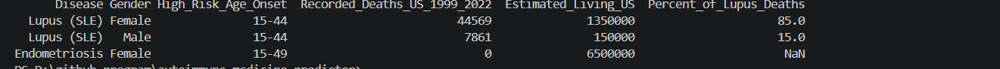

# 💊 Autoimmune Medicine Predictor

A data analysis and visualization project exploring treatment 
success rates across different autoimmune disease drug categories.

## 📌 What This Does
- Analyzes treatment success rates for common autoimmune conditions
- Visualizes drug performance across patient categories
- Identifies patterns in medicine effectiveness using statistical analysis

## 📊 Output

<!-- add a screenshot of your actual plot here -->

## 🛠️ Stack
- Python 3.x
- NumPy — numerical computation
- Pandas — data wrangling
- Matplotlib — visualization

## 🚀 How to Run
git clone https://github.com/sushanttds-jpg/autoimmune_medicine_predictor
cd autoimmune_medicine_predictor
pip install numpy pandas matplotlib
python main.py

## 📁 Project Structure
autoimmune_medicine_predictor/
├── main.py          # main analysis script
├── data.csv         # dataset
├── dashboard.png    # output visualization
└── README.md

## 🎓 Context
Built as part of my data
